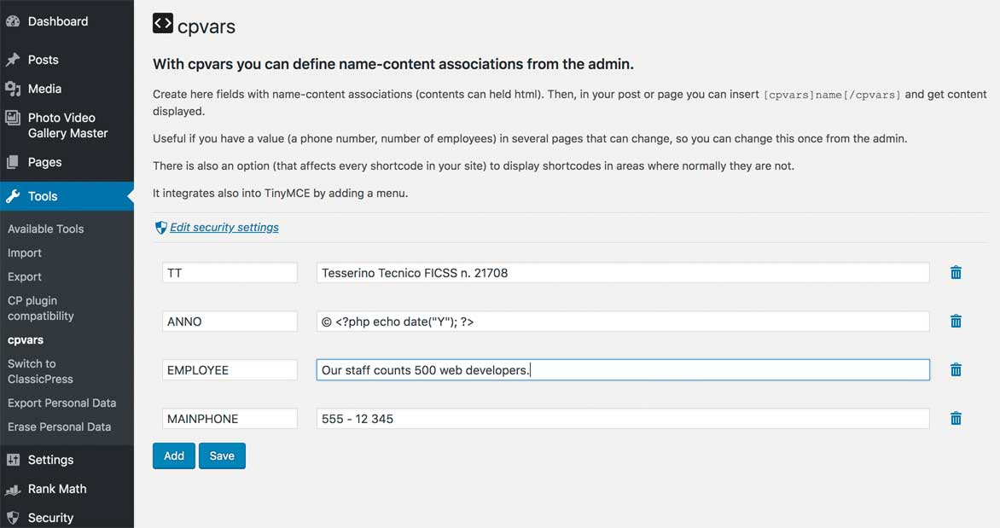
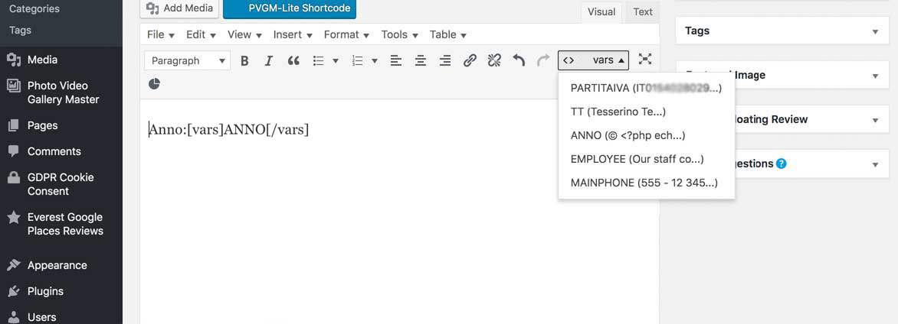
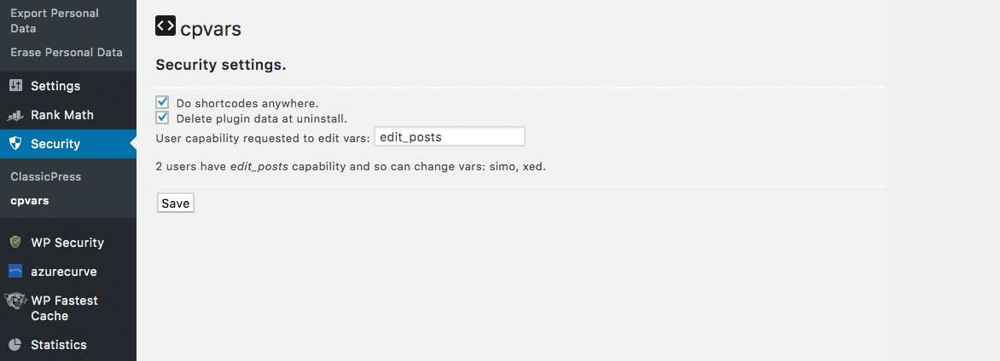

# vars

## With vars you can define name-value associations from the admin.

Then, in your content you can insert
`[vars]name[/vars]`
and get _value_ displayed.

Useful if you have a value (a phone number, number of employees) in several pages that can change, so you can change this once from the admin.

It **integrates into TinyMCE** by adding a menu.

You can choose which users can manage vars.

Look at the [screenshots](#screenshots).

## Shortcodes everywhere
There is also an option (that affects every shortcode in your site) to **display shortcodes in areas where normally they are not**.

- single\_post\_title
- the\_title
- widget\_text
- widget\_title
- bloginfo
- get\_post\_metadata

## Updating
This plugin supports [GitHub Updater](https://github.com/afragen/github-updater).
This allows to upgrade to the latest code.
If not installed, you will be noticed about new releases on the plugin page,
and you'll need to install the new version manually.

### Updating to 1.3.0
When you upgrade from a previous version to 1.3.0, please deactivate and reactivate the plugin to be sure that the migration is complete.


## Integration
### Security menu
If running ClassicPress 1.1.0 or newer those settings are moved to the Security menu: choose which users can manage vars, what to do with vars when uninstalling and apply shortcodes everywhere
### Functions
If you would like to **use in your theme/plugin**
`vars_do('name')`
and get _value_ displayed.
### Filters
There is a **filter** called *vars_output*

An example to capitalize the output.
```php
function vars_output_upper( $string ) {
    return strtoupper( $string );
}
add_filter( 'vars_output', 'vars_output_upper' );
```
An example to use it to **exec PHP code**. **Dangerous**, don't do it.
You have to open and close php tags in your string.
```php
function vars_output_exec_php( $string ) {
    ob_start();
    eval( "?>" . $string ."<?php" );
    $evalContent = ob_get_contents();
    ob_end_clean();
    return $evalContent;
}
add_filter( 'vars_output', 'vars_output_exec_php' );
```

<a name="screenshots"></a>
## Screenshots






